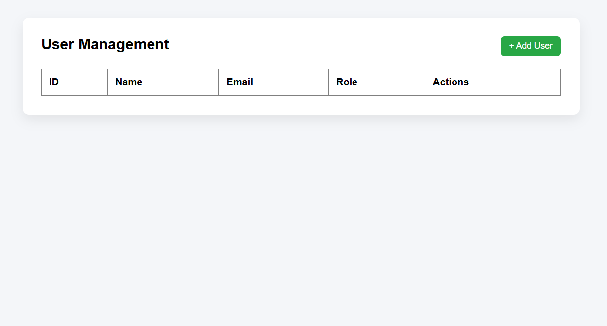
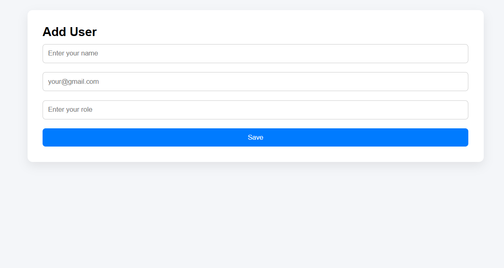
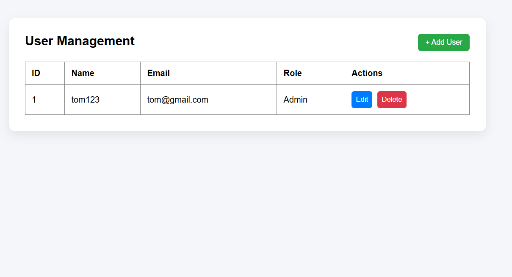

🚀 User Management System

A Full Stack Web Application built using Spring Boot and React to manage user records with complete CRUD operations.

Project Overview

The User Management System allows users to:

➕ Add new users

📋 View all users

✏️ Update existing users

❌ Delete users

This project demonstrates full-stack development using REST APIs and frontend-backend integration.

🛠️ Tech Stack
🔹 Backend

Java

Spring Boot

Spring Data JPA

Hibernate

MySQL

Maven

🔹 Frontend

React

Vite

JavaScript (ES6+)

CSS

🏗️ Project Structure
User-Management-System
│
├── Backend/
│   └── Spring Boot Application
│
└── Frontend/
    └── React Application Project Structure

⚙️ Features

RESTful API development

Layered architecture (Controller, Service, Repository)

Exception handling with GlobalExceptionHandler

Frontend integration with backend APIs

Form validation

Clean UI with reusable components

API Endpoints
| Method | Endpoint    | Description     |
| ------ | ----------- | --------------- |
| GET    | /users      | Get all users   |
| GET    | /users/{id} | Get user by ID  |
| POST   | /users      | Create new user |
| PUT    | /users/{id} | Update user     |
| DELETE | /users/{id} | Delete user     |

▶️ How to Run the Project
1️⃣ Run Backend

cd Backend/UserManagementSystem
mvn spring-boot:run

Backend runs on:
http://localhost:8080

2️⃣ Run Frontend
cd Frontend/User-Management-Frontend
npm install
npm run dev

Frontend runs on:
http://localhost:5173

## 📷 Screenshots

### 🏠 Home Page

### ➕ Add User

### 📋 User List

### ✏️ Update User

👨‍💻 Author
Puneeth Reddy A P
Aspiring Java Full Stack Developer

⭐ If you like this project, give it a star!
